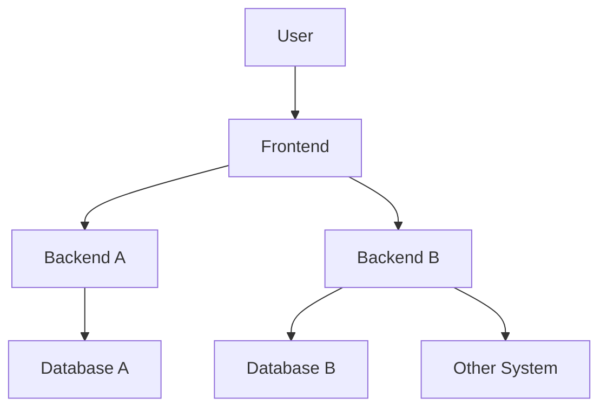

# Pengenalan Software Testing
- Software testing adalah salah satu disiplin ilmu dalam software engineering.
- Tujuan utama dari software testing adalah memastikan kualitas kode dan aplikasi kita baik.
- Ilmu untuk software testing sendiri sangatlah luas, pada materi ini kita hanya akan fokus ke unit testing.

## Contoh High Level Architecture Aplikasi


## Unit Test
- Unit test akan fokus menguji bagian kode program terkecil, biasanya menguji sebuah method.
- Unit test biasanya dibuat kecil dan cepat, terkadang kode unit test lebih banyak dari kode program aslinya, karena semua skenario pengujian akan dicoba di unit test.
- Unit test bisa digunakan sebagai cara untuk meningkatkan kualitas kode program kita.

# Pengenalan JUnit
- JUnit adalah salah satu test framework yang populer di Java.
- Saat ini versi terbaru JUnit adalah versi 5.
- JUnit 5 membutuhkan Java minimal versi 8.
- [JUnit](https://junit.org).

# Menambah JUnit 5 di Apache Maven
```xml
<project>
    <dependencies>
        <dependency>
            <groupId>org.junit.jupiter</groupId>
            <artifactId>junit-jupiter</artifactId>
            <version>5.6.2</version>
            <scope>test</scope>
        </dependency>
    </dependencies>
</project>
```

# Membuat Test
- Untuk membuat test di JUnit itu sederhana, kita cukup membuat class, lalu menambahkan method-method test-nya.
- Method akan dianggap sebuah test jika ditambahkan annotation ```@Test```
- Kode test disimpan dibagian test folder di maven, bukan di main folder.
- Biasanya saat membuat class untuk test, rata-rata orang biasa membuat nama class-nya sama dengan nama class yang akan di test, tapi diakhiri dengan kata **Test**, misal jika nama class-nya adalah Calculator, maka nama class test-nya adalah CalculatorTest.
- Kode: Class Calculator
```java
public class Calculator {
    public Integer add(Integer first, Integer second) {
        return first + second;
    }
} 
```
- Kode: Unit Test Class Calculator
```java
import org.junit.jupiter.api.Test;

public class CalculatorTest {
    private Calculator calculator = new Calculator();
    
    @Test
    public void testAddSuccess() {
        var result = calculator.add(10, 10);
    }
} 
```

# Menggunakan Assertions
- Saat membuat test, kita harus memastikan bahwa test tersebut sesuai dengan ekspektasi yang kita inginkan.
- Jika manual, kita bisa melakukan pengecekan if else, namun itu tidak direkomendasikan.
- JUnit memiliki fitur untuk melakukan assertions, yaitu memastikan bahwa unit test sesuai dengan kondisi yang kita inginkan.
- Assertions di JUnit di representasikan dalam class Assertions, dan di dalamnya terdapat banyak sekali function static.
- [Dokumentasi Assertions JUnit](https://junit.org/junit5/docs/current/api/org.junit.jupiter.api/org/junit/jupiter/api/Assertions.html).

## Meng-import Assertions
```java
import org.junit.jupiter.api.Test;
import static org.junit.jupiter.api.Assertions.*;

public class CalculatorTest {
    private Calculator calculator = new Calculator();

    @Test
    public void testAddSuccess() {
        var result = calculator.add(10, 10);
    }
} 
```

## Menggunakan Assertions
```java
import org.junit.jupiter.api.Test;
import static org.junit.jupiter.api.Assertions.*;

public class CalculatorTest {
    private Calculator calculator = new Calculator();

    @Test
    public void testAddSuccess() {
        var result = calculator.add(10, 10);
        assertEquals(20, result);
    }
}
```

## Menggagalkan Test
- Kadang dalam membuat unit test, kita tidak hanya ingin mengetest kasus suskses atau gagal.
- Ada kalanya kita ingin mengetes sebuah exception misalnya.
- Assertions juga bisa digunakan untuk mengecek apakah sebuah exception terjadi.
- Kode: Calculator Divide
```java
public class Calculator {
    public Integer divide(Integer first, Integer second) {
        if (second == 0) {
            throw new IllegalArgumentException("Can not divide by zero");
        } else {
            return first / second;
        }
    }
}
```
- Kode: Assertions Exception
```java
import org.junit.jupiter.api.Test;
import static org.junit.jupiter.api.Assertions.*;

public class CalculatorTest {
    private Calculator calculator = new Calculator();
    
    @Test
    public void testDivideSuccess() {
        var result = calculator.divide(100, 10);
        assertEquals(10, result);
    }
    
    @Test
    public void testDivideError() {
        assertThrows(IllegalArgumentException.class, () -> {
           calculator.divide(100, 0); 
        });
    }
}
```

# Mengubah Nama Test
- Kadang agak sulit membuat nama function yang merepresentasikan kasus test-nya.
- Jika kita ingin menambahkan deskripsi untuk tiap test, kita bisa menggunakan annotation ```@DisplayName```.
- Dengan menggunakan annotation ```@DisplayName```, kita bisa menambahkan deskripsi unit test-nya.
- Kode: Menggunakan DisplayName
```java
@DisplayName("Test Calculator")
public class CalculatorTest {
    private Calculator calculator = new Calculator();
    
    @Test
    @DisplayName("Test Function Calculator.add(Integer, Integer)")
    public void testAddSuccess() {
        var result = calculator.add(10, 10);
        assertEquals(20, result);
    }
}
```

## Menggunakan Display Name Generator
- JUnit mendukung pembuatan DisplayName secara otomatis menggunakan generator.
- Yang perlu kita lakukan adalah membuat class turunan dari interface DisplayNameGenerator, lalu menambahkan annotation ```@DisplayNameGenerator``` di test class-nya.
- Kode: Display Name Generator
```java
import org.junit.jupiter.api.DisplayNameGenerator;

import java.lang.reflect.Method;

public class SimpleDisplayNameGenerator implements DisplayNameGenerator {
    @Override
    public String generateDisplayNameForClass(Class<?> testClass) {
        return "Test " + testClass.getSimpleName();
    }
    
    @Override
    public String generateDisplayNameForMethod(Class<?> testClass, Method testMethod) {
        return "Test " + testMethod.getName();
    }
}
```
- Kode: Display Name Generation
```java
import org.junit.jupiter.api.DisplayNameGeneration;

@DisplayNameGeneration(value = SimpleDisplayNameGenerator.class)
public class CalculatorTest {
    private Calculator calculator = new Calculator();

    @Test
    public void testAddSuccess() {
        var result = calculator.add(10, 10);
        assertEquals(20, result);
    }
}
```

# Menonaktifkan Test
- Kadang ada kalanya kita ingin menonaktifkan unit test, misal karena terjadi error di unit test tersebut, dan belum bisa kita perbaiki.
- Sebenarnya cara paling mudah untuk menonaktifkan unit test adalah dengan menghapus annotation ```@Test```, namun jika kita lakukan itu, kita tidak bisa mendeteksi kalo ada unit test yang di disabled.
- Untuk menonaktifkan unit test secara benar, kita bisa menggunakan annotation ```@Disabled```.

# Sebelum & Setelah Unit Test
- Kadang kita ingin menjalankan kode yang sama sebelum dan setelah eksekusi unit test.
- Hal ini sebenarnya bisa dilakukan secara manual di function ```@Test```-nya, namun hal ini akan membuat kode duplikat banyak sekali.
- JUnit memiliki annotation ```@BeforeEach``` & ```@AfterEach```.
- ```@BeforeEach``` digunakan untuk menandai function yang akan dieksekusi sebelum unit test dijalankan.
- ```@AfterEach``` digunakan untuk menandai function yang akan dieksekusi setelah unit test dijalankan.
- Ingat, bahwa ini akan selalu dieksekusi setiap kali untuk function ```@Test```, bukan sekali untuk class test saja.
- Kode: BeforeEach dan AfterEach
```java
public class CalculatorTest {
    private Calculator calculator = new Calculator();
    
    @BeforeEach
    public void setUp() {
        System.out.println("Before unit test");
    }
    
    @AfterEach
    public void tearDown() {
        System.out.println("After unit test");
    }
}
```

## Sebelum & Setelah Semua Unit Test
- ```@BeforeEach``` & ```@AfterEach``` akan dieksekusi setiap kali function ```@Test``` jalan.
- Namun kadang kita ingin melakukan sesuatu sebelum semua unit test berjalan, atau setelah semua unit test berjalan.
- Ini bisa dilakukan menggunakan annotation ```@BeforeAll``` & ```@AfterAll```.
- Namun hanya static function yang bisa menggunakan ```@BeforeAll``` & ```@AfterAll```.
- Kode: BeforeAll & AfterAll
```java
public class CalculatorTest {
    @BeforeAll
    public static void beforeAll() {
        System.out.println("Before all");
    }
    
    @AfterAll
    public static void afterAll() {
        System.out.println("After all");
    }
}
```

# Membatalkan Test
- Kadang kita ingin membatalkan unit test ketika kondisi tertentu terjadi.
- Untuk membatalkan, kita bisa menggunakan exception TestAbortedException.
- Jika JUnit mendapatkan exception TestAbortedException, secara otomatis test tersebut akan dibatalkan.
- Kode: Membatalkan Test
```java
public class CalculatorTest {
    @Test
    public void testAborted() {
        var profile = System.getenv("PROFILE");
        
        if (!"DEV".equals(profile)) {
            throw new TestAbortedException();
        }
    }
}
```

# Menggunakan Assumptions
- Sebelumnya kita sudah tahu jika ingin membatalkan test, kita bisa menggunakan exception TestAbortedException.
- Namun sebenarnya ada cara yang lebih mudah, yaitu dengan menggunakan Assumptions.
- Penggunakan Assumptions mirip seperti Assertions, jika nilainya tidak sama, maka function Assumptions akan throw TestAbortedException, sehingga secara otomatis akan membatalkan unit test yang sedang berjalan.
- [Dokumentasi Assumptions](https://junit.org/junit5/docs/current/api/org.junit.jupiter.api/org/junit/jupiter/api/Assumptions.html).
- Kode: Import Assumptions
```java
import static org.junit.jupiter.api.Assumptions.*;

public class CalculatorTest {
    private Calculator calculator = new Calculator();
}
```
- Kode: Menggunakan Assumptions
```java
public class CalculatorTest {
    @Test
    public void testAssumptions() {
        assumeTrue("DEV".equals(System.getenv("PROFILE")));
    }
}
```

# Test Berdasarkan Kondisi 
- Sebenarnya kita bisa menggunakan Assumptions untuk menjalankan unit test berdasarkan kondisi tertentu.
- Namun JUnit menyediakan fitur yang lebih mudah untuk pengecekan beberapa kondisi, seperti kondisi sistem operasi, versi Java, system property atau environment variable.
- Ini lebih mudah dibandingkan menggunakan Assumptions.

## Kondisi Sistem Operasi
- Untuk kondisi sistem operasi, kita bisa menggunakan beberapa annotation.
- ```@EnabledOnOs``` digunakan untuk penanda bahwa unit test boleh berjalan di sistem operasi yang ditentukan.
- ```@DisabledOnOs``` digunakan untuk penanda bahwa unit test tidak boleh berjalan di sistem operasi yang ditentukan.
- Kode: Kondisi Sistem Operasi
```java
public class ConditionTest {
    @Test
    @EnabledOnOs(value = {OS.WINDOWS})
    public void onlyRunOnWindows() {
        // put your unit test
    }
    
    @Test
    @DisabledOnOs(value = {OS.WINDOWS})
    public void disabledRunOnWindows() {
        // put your unit test
    }
}
```

## Kondisi Versi Java
- Untuk kondisi versi Java yang kita gunakan, kita bisa menggunakan beberapa annotation.
- ```@EnabledOnJre``` digunakan untuk penanda bahwa unit test boleh berjalan di Java versi tertentu.
- ```@DisabledOnJre``` digunakan untuk penanda bahwa unit test tidak boleh berjalan di Java versi tertentu.
- ```@EnabledForJreRange``` digunakan untuk penanda bahwa unit test boleh berjalan di range Java versi tertentu.
- ```@DisabledForJreRange``` digunakan untuk penanda bahwa unit test tidak boleh berjalan di range Java versi tertentu.
- Kode: Kondisi Versi Java
```java
public class ConditionTest {
    @Test
    @EnabledOnJre(value = {JRE.JAVA_14})
    public void onlyRunOnJava14() {
        // put your unit test
    }

    @Test
    @DisabledOnJre(value = {JRE.JAVA_14})
    public void disabledRunOnJava14() {
        // put your unit test
    }

    @Test
    @EnabledForJreRange(min = JRE.JAVA_11, max = JRE.JAVA_15)
    public void onlyRunOnJava11To15() {
        // put your unit test
    }

    @Test
    @DisabledForJreRange(min = JRE.JAVA_11, max = JRE.JAVA_15)
    public void disabledRunOnJava11To15() {
        // put your unit test
    }
}
```

## Kondisi System Property
- Untuk kondisi nilai dari system property, kita bisa menggunakan beberapa annotation.
- ```@EnabledIfSystemProperty``` untuk penanda bahwa unit test boleh berjalan jika system property sesuai dengan yang ditentukan.
- ```@DisabledIfSystemProperty``` untuk penanda bahwa unit test tidak boleh berjalan jika system property sesuai dengan yang ditentukan.
- Jika kondisinya lebih dari satu, kita bisa menggunakan ```@EnabledIfSystemProperties``` dan ```@DisabledIfSystemProperties```.
- Kode: Kondisi System Properties
```java
public class ConditionTest {
    @Test
    @EnabledIfSystemProperty(named = "java.vendor", matches = "Oracle Corporation")
    public void enabledOnOracle() {
        // put your unit test
    }

    @Test
    @DisabledIfSystemProperty(named = "java.vendor", matches = "Oracle Corporation")
    public void disabledOnOracle() {
        // put your unit test
    }

    @Test
    @EnabledIfSystemProperties({
            @EnabledIfSystemProperty(named = "java.vendor", matches = "Oracle Corporation")
    })
    public void enabledOnOracles() {
        // put your unit test
    }

    @Test
    @DisabledIfSystemProperties({
            @DisabledIfSystemProperty(named = "java.vendor", matches = "Oracle Corporation")
    })
    public void disabledOnOracles() {
        // put your unit test
    }
}
```

## Kondisi Environment Variable
- Untuk kondisi nilai dari environment variable, kita bisa menggunakan beberapa annotation.
- ```@EnabledIfEnvironmentVariable``` untuk penanda bahwa unit test boleh berjalan jika environment variable sesuai dengan yang ditentukan.
- ```@DisabledIfEnvironmentVariable``` untuk penanda bahwa unit test tidak boleh berjalan jika environment variable sesuai dengan yang ditentukan.
- Jika kondisinya lebih dari satu, kita bisa menggunakan ```@EnabledIfEnvironmentVariables``` dan ```@DisabledIfEnvironmentVariables```.
- Kode: Kondisi Environment Variable
```java
public class ConditionTest {
    @Test
    @EnabledIfEnvironmentVariable(named = "PROFILE", matches = "DEV")
    public void enabledOnProfileDev() {
        // put your unit test
    }

    @Test
    @DisabledIfEnvironmentVariable(named = "PROFILE", matches = "DEV")
    public void disabledOnProfileDev() {
        // put your unit test
    }

    @Test
    @EnabledIfEnvironmentVariables({
            @EnabledIfEnvironmentVariable(named = "PROFILE", matches = "DEV")
    })
    public void enabledOnEnvironmentVariables() {
        // put your unit test
    }

    @Test
    @DisabledIfEnvironmentVariables({
            @DisabledIfEnvironmentVariable(named = "PROFILE", matches = "DEV")
    })
    public void disabledOnEnvironmentVariables() {
        // put your unit test
    }
}
```

# Menggunakan Tag
- Class atau function unit test bisa kita tambahkan tag (tanda) dengan menggunakan annotation ```@Tag```.
- Dengan menambahkan tag ke dalam unit test, kita bisa fleksibel ketika menjalan unit test, bisa memilih tag mana yang mau di include atau di exclude.
- Jika kita menambahkan tag di class unit test, secara otomatis semua function unit test di dalam class tersebut akan memiliki tag tersebut.
- Jika kita ingin menambahkan beberapa tag di satu class atau function unit test, kita bisa menggunakan annotation ```@Tags```.
- Kode: Menambahkan Tag
```java
@Tag("integration-test")
public class SampleIntegrationTest {
    @Test
    public void integrationTest1() {
        System.out.println("Integration test 1");
    }
    
    @Test
    public void integrationTest2() {
        System.out.println("Integration test 2");
    }
}
```

## Memilih Tag dengan Maven
```shell
mvn test -Dgroups=tag1,tag2
```

# Urutan Eksekusi Test
- Secara default, urutan eksekusi unit test tidak ditentukan, jadi jangan berharap jika sebuah method berada diatas method lainnya, maka akan dijalankan lebih dulu.
- Hal ini karena memang sebaiknya method unit test itu harus independen, tidak saling ketergantungan.
- Secara default pun, object class unit test akan selalu dibuat ulang tiap method, jadi jangan berharap kita bisa menyimpan data di variable untuk digunakan di unit test method selanjutnya.

## Mengubah Urutan Eksekusi Test
- JUnit mendukung perubahan urutan eksekusi test jika kita mau menggunakan annotation ```@TestMethodOrder```, ada beberapa cara yang bisa kita lakukan.
- Alphanumeric, artinya urutan eksekusi unit test akan diurutkan berdasarkan alphanumeric.
- Random, artinya urutan-urutan eksekusi unit test akan dieksekusi secara random.
- OrderAnnotation, artinya urutan eksekusi unit test akan mengikuti annotation ```@Order``` yang ada di tiap method unit test.
- Kode: Menggunakan Order Annotation
```java
@TestMethodOrder(value = MethodOrderer.OrderAnnotation.class)
public class OrderedTest {
    @Test
    @Order(3)
    public void test3() {
        // put your unit test
    }

    @Test
    @Order(2)
    public void test2() {
        // put your unit test
    }

    @Test
    @Order(1)
    public void test1() {
        // put your unit test
    }
}
```

## Membuat Urutan Sendiri
- Jika kita ingin membuat cara mengurutkan urutan unit test function sendiri, kita bisa dengan mudah membuat class baru turunan dari MethodOrderer interface.

# Siklus Hidup Test
- Secara default, lifecycle (siklus hidup) object test adalah independent per method test, artinya object unit test akan selalu dibuat baru per method unit test, oleh karena itu kita tidak bisa bergantung dengan method test lain.
- Cara pembuatan object test di JUnit ditentukan oleh annotation ```@TestInstance```, dimana default-nya adalah ```Lifecycle.PER_METHOD```, artinya tiap method akan dibuat sebuah instance / object baru.
- Kita bisa merubahnya menjadi ```Lifecycle.PER_CLASS``` jika mau, dengan demikian instance / object test hanya dibuat sekali per class, dan method test akan menggunakan object test yang sama.
- Hal ini bisa kita manfaatkan ketika membuat test yang tergantung dengan test lain.
- Kode: Menggunakan Instance Per Class
```java
@TestInstance(value = TestInstance.Lifecycle.PER_CLASS)
@TestMethodOrder(value = MethodOrderer.OrderAnnotation.class)
public class OrderedTest {
    private int count = 0;

    @Test
    @Order(3)
    public void test3() {
        // put your unit test
        count++;
        System.out.println(count);
    }

    @Test
    @Order(2)
    public void test2() {
        // put your unit test
    }

    @Test
    @Order(1)
    public void test1() {
        // put your unit test
    }
}
```

## Keuntungan Instance Per Class
- Salah satu keuntungan saat menggunakan ```Lifecycle.PER_CLASS``` adalah, kita bisa menggunakan ```@BeforeAll``` & ```@AfterAll``` di method biasa, tidak harus menggunakan function object / static.
- Kode: BeforeAll dan AfterAll
```java
@TestInstance(value = TestInstance.Lifecycle.PER_CLASS)
@TestMethodOrder(value = MethodOrderer.OrderAnnotation.class)
public class OrderedTest {
    private int count = 0;
    
    @BeforeAll
    public void beforeAll() {
        
    }
    
    @AfterAll
    public void afterAll() {
        
    }

    @Test
    @Order(3)
    public void test3() {
        // put your unit test
        count++;
        System.out.println(count);
    }

    @Test
    @Order(2)
    public void test2() {
        // put your unit test
    }

    @Test
    @Order(1)
    public void test1() {
        // put your unit test
    }
}
```

# Test di dalam Test
- Saat membuat unit test, ada baiknya ukuran test class-nya tidak terlalu besar, karena akan sulit di baca dan dimengerti.
- Jika test class sudah semakin besar, ada baiknya kita pecah menjadi beberapa test class, lalu kita grouping sesuai dengan jenis method test-nya.
- JUnit mendukung pembuatan class test di dalam class test, jadi kita bisa memecah sebuah class test, tanpa harus membuat class di file berbeda, kita bisa cukup menggunakan inner class.
- Untuk memberi tahu bahwa inner class tersebut adalah test class, kita bisa menggunakan annotation ```@Nested```.
- Kode: Test di dalam Test
```java
@DisplayName("A Queue")
public class QueueTest {
    private Queue<String> queue;
    
    @Nested
    @DisplayName("When new")
    public class WhenNew {
        @BeforeEach
        public void setUp() {
            queue = new LinkedList<>();
        }
    }
}
```

# Informasi Test
- Walaupun mungkin jarang kita gunakan, tapi kita juga bisa mendapatkan informasi test yang sedang berjalan menggunakan interface TestInfo.
- Kita bisa menambahkan TestInfo sebagai parameter di function unit test.
- Kode: Menggunakan Test Info
```java
@DisplayName("Test with TestInfo")
public class InformationTest{
    @Test
    @Tag("cool")
    @DisplayName("This is test one")
    public void testOne(TestInfo testInfo) {
        System.out.println(testInfo.getDisplayName());
        System.out.println(testInfo.getTags());
        System.out.println(testInfo.getTestMethod());
        System.out.println(testInfo.getTestClass());
    }
}
```

# Dependency Injection di Test
- Tidak ada magic di JUnit, sebenarnya fitur TestInfo yang sebelumnya kita bahas adalah bagian dari dependency injection di JUnit.
- Dependency injection sederhanannya adalah bagaimana kita bisa memasukkan dependency (object/instance) ke dalam unit test secara otomatis tanpa proses manual.
- Saat kita menambah parameter di function unit test, sebenarnya kita bisa secara otomatis memasukkan parameter tersebut dengan bantuan ParameterResolver.
- Contohnya TestInfo yang kita bahas sebelumnya, sebenarnya object tersebut dibuat oleh TestInfoParameterResolver.
- Kode: Membuat Random Parameter Resolver
```java
public class RandomParameterResolver implements ParameterResolver {
    private Random random = new Random();
    
    @Override
    public boolean supportsParameter(ParameterContext parameterContext, ExtensionContext extensionContext) {
        return parameterContext.getParameter().getType() == Random.class;
    }
    
    @Override
    public Object resolveParameter(ParameterContext parameterContext, ExtensionContext extensionContext) {
        return random;
    }
}
```

## Menggunakan Parameter Resolver 
- Untuk menggunakan parameter resolver yang sudah kita buat, kita bisa menggunakan annotation ```@ExtendWith``` di test class.
- Jika lebih dari 1 parameter resolver, kita bisa menggunakan ```@Extensions```.
- Kode: Menggunakan Random Resolver
```java
@Extensions(value = { @ExtendWith(RandomParameterResolver.class) })
public class RandomCalculatorTest {
    private Calculator calculator = new Calculator();
    
    @Test
    public void testRandom(Random random) {
        var a = random.nextInt();
        var b = random.nextInt();
        assertEquals(a + b, calculator.add(a, b));
    }
}
```

# Pewarisan di Test
- JUnit mendukung pewarisan di test, artinya jika kita membuat class atau interface dan menambahkan informasi test disitu, maka ketika kita membuat turunannya, secara otomatis semua fitur test-nya dimiliki oleh turunannya.
- Ini sangat cocok ketika kita misal contohnya sering membuat code sebelum dan setelah test yang berulang-ulang, sehingga dibanding dibuat di semua test class, lebih baik dibuat sekali di parent test class, dan test class tinggal menjadi child class dari parent test class.
- Kode: Membuat Parent Test Class
```java
@Extensions(value = {
        @ExtendWith(RandomParameterResolver.class)
})
public class ParentCalculatorTest {
    protected Calculator calculator = new Calculator();
    
    @BeforeEach
    public void setUp() {
        System.out.println("Before each");
    }
}
```
- Kode: Membuat Child Test Class
```java
public class RandomCalculatorTest extends ParentCalculatorTest {
    @Test
    public void testRandom() {
        var a = random.nextInt();
        var b = random.nextInt();
        assertEquals(a + b, calculator.add(a, b));
    }
}
```