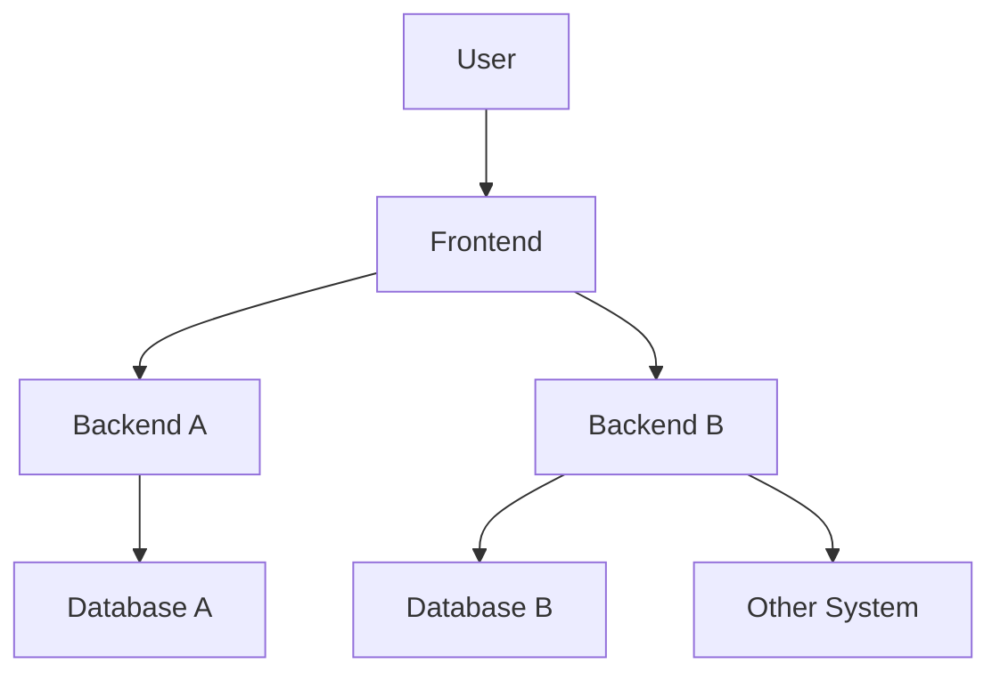

# Pengenalan Software Testing
- Software testing adalah salah satu disiplin ilmu dalam software engineering.
- Tujuan utama dari software testing adalah memastikan kualitas kode dan aplikasi kita baik.
- Ilmu untuk software testing sendiri sangatlah luas, pada materi ini kita hanya akan fokus ke unit testing.

## Contoh High Level Architecture Aplikasi


## Unit Test
- Unit test akan fokus menguji bagian kode program terkecil, biasanya menguji sebuah method.
- Unit test biasanya dibuat kecil dan cepat, terkadang kode unit test lebih banyak dari kode program aslinya, karena semua skenario pengujian akan dicoba di unit test.
- Unit test bisa digunakan sebagai cara untuk meningkatkan kualitas kode program kita.

# Pengenalan JUnit
- JUnit adalah salah satu test framework yang populer di Java.
- Saat ini versi terbaru JUnit adalah versi 5.
- JUnit 5 membutuhkan Java minimal versi 8.
- [JUnit](https://junit.org).

# Menambah JUnit 5 di Apache Maven
```xml
<project>
    <dependencies>
        <dependency>
            <groupId>org.junit.jupiter</groupId>
            <artifactId>junit-jupiter</artifactId>
            <version>5.6.2</version>
            <scope>test</scope>
        </dependency>
    </dependencies>
</project>
```

# Membuat Test
- Untuk membuat test di JUnit itu sederhana, kita cukup membuat class, lalu menambahkan method-method test-nya.
- Method akan dianggap sebuah test jika ditambahkan annotation ```@Test```
- Kode test disimpan dibagian test folder di maven, bukan di main folder.
- Biasanya saat membuat class untuk test, rata-rata orang biasa membuat nama class-nya sama dengan nama class yang akan di test, tapi diakhiri dengan kata **Test**, misal jika nama class-nya adalah Calculator, maka nama class test-nya adalah CalculatorTest.
- Kode: Class Calculator
```java
public class Calculator {
    public Integer add(Integer first, Integer second) {
        return first + second;
    }
} 
```
- Kode: Unit Test Class Calculator
```java
import org.junit.jupiter.api.Test;

public class CalculatorTest {
    private Calculator calculator = new Calculator();
    
    @Test
    public void testAddSuccess() {
        var result = calculator.add(10, 10);
    }
} 
```

# Menggunakan Assertions
- Saat membuat test, kita harus memastikan bahwa test tersebut sesuai dengan ekspektasi yang kita inginkan.
- Jika manual, kita bisa melakukan pengecekan if else, namun itu tidak direkomendasikan.
- JUnit memiliki fitur untuk melakukan assertions, yaitu memastikan bahwa unit test sesuai dengan kondisi yang kita inginkan.
- Assertions di JUnit di representasikan dalam class Assertions, dan di dalamnya terdapat banyak sekali function static.
- [Dokumentasi Assertions JUnit](https://junit.org/junit5/docs/current/api/org.junit.jupiter.api/org/junit/jupiter/api/Assertions.html).

## Meng-import Assertions
```java
import org.junit.jupiter.api.Test;
import static org.junit.jupiter.api.Assertions.*;

public class CalculatorTest {
    private Calculator calculator = new Calculator();

    @Test
    public void testAddSuccess() {
        var result = calculator.add(10, 10);
    }
} 
```

## Menggunakan Assertions
```java
import org.junit.jupiter.api.Test;
import static org.junit.jupiter.api.Assertions.*;

public class CalculatorTest {
    private Calculator calculator = new Calculator();

    @Test
    public void testAddSuccess() {
        var result = calculator.add(10, 10);
        assertEquals(20, result);
    }
}
```

## Menggagalkan Test
- Kadang dalam membuat unit test, kita tidak hanya ingin mengetest kasus suskses atau gagal.
- Ada kalanya kita ingin mengetes sebuah exception misalnya.
- Assertions juga bisa digunakan untuk mengecek apakah sebuah exception terjadi.
- Kode: Calculator Divide
```java
public class Calculator {
    public Integer divide(Integer first, Integer second) {
        if (second == 0) {
            throw new IllegalArgumentException("Can not divide by zero");
        } else {
            return first / second;
        }
    }
}
```
- Kode: Assertions Exception
```java
import org.junit.jupiter.api.Test;
import static org.junit.jupiter.api.Assertions.*;

public class CalculatorTest {
    private Calculator calculator = new Calculator();
    
    @Test
    public void testDivideSuccess() {
        var result = calculator.divide(100, 10);
        assertEquals(10, result);
    }
    
    @Test
    public void testDivideError() {
        assertThrows(IllegalArgumentException.class, () -> {
           calculator.divide(100, 0); 
        });
    }
}
```

# Mengubah Nama Test
- Kadang agak sulit membuat nama function yang merepresentasikan kasus test-nya.
- Jika kita ingin menambahkan deskripsi untuk tiap test, kita bisa menggunakan annotation ```@DisplayName```.
- Dengan menggunakan annotation ```@DisplayName```, kita bisa menambahkan deskripsi unit test-nya.
- Kode: Menggunakan DisplayName
```java
@DisplayName("Test Calculator")
public class CalculatorTest {
    private Calculator calculator = new Calculator();
    
    @Test
    @DisplayName("Test Function Calculator.add(Integer, Integer)")
    public void testAddSuccess() {
        var result = calculator.add(10, 10);
        assertEquals(20, result);
    }
}
```

## Menggunakan Display Name Generator
- JUnit mendukung pembuatan DisplayName secara otomatis menggunakan generator.
- Yang perlu kita lakukan adalah membuat class turunan dari interface DisplayNameGenerator, lalu menambahkan annotation ```@DisplayNameGenerator``` di test class-nya.
- Kode: Display Name Generator
```java
import org.junit.jupiter.api.DisplayNameGenerator;

import java.lang.reflect.Method;

public class SimpleDisplayNameGenerator implements DisplayNameGenerator {
    @Override
    public String generateDisplayNameForClass(Class<?> testClass) {
        return "Test " + testClass.getSimpleName();
    }
    
    @Override
    public String generateDisplayNameForMethod(Class<?> testClass, Method testMethod) {
        return "Test " + testMethod.getName();
    }
}
```
- Kode: Display Name Generation
```java
import org.junit.jupiter.api.DisplayNameGeneration;

@DisplayNameGeneration(value = SimpleDisplayNameGenerator.class)
public class CalculatorTest {
    private Calculator calculator = new Calculator();

    @Test
    public void testAddSuccess() {
        var result = calculator.add(10, 10);
        assertEquals(20, result);
    }
}
```

# Menonaktifkan Test
- Kadang ada kalanya kita ingin menonaktifkan unit test, misal karena terjadi error di unit test tersebut, dan belum bisa kita perbaiki.
- Sebenarnya cara paling mudah untuk menonaktifkan unit test adalah dengan menghapus annotation ```@Test```, namun jika kita lakukan itu, kita tidak bisa mendeteksi kalo ada unit test yang di disabled.
- Untuk menonaktifkan unit test secara benar, kita bisa menggunakan annotation ```@Disabled```.
